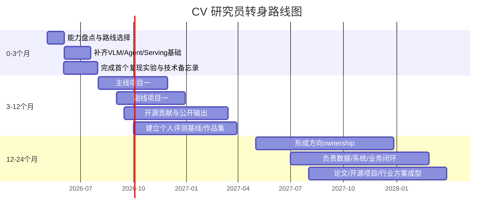
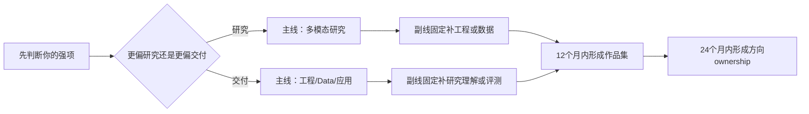

## 执行性摘要

基于你上传的草稿，我将其视为你“现有思路”的代理版本；与此同时，按你的要求，报告假设你**没有单独提供一份正式大纲**。从这个上传稿看，你已经抓住了几条真正重要的主线：异构多模态架构的瓶颈、统一建模的吸引力、视觉基础模型的再崛起，以及从静态感知走向交互式视觉系统的趋势。问题不在于方向错，而在于**结构偏“研究前沿评论”而弱“职业转身指南”**：工程化、数据工程、行业应用、开源/创业、评测与安全、项目路线图、岗位与薪酬这几块明显不足。与此同时，稿中对 SAM 3、长视觉上下文、以及“异构架构必然过时”的表述需要更新或收敛。fileciteturn0file0 citeturn24view0turn24view3turn27view3

如果这篇博客的目标读者是“传统 CV/DL 算法研究员和从业者”，那么最好的写法不是劝大家“投奔大模型”，而是说明：**CV 的价值从单点感知能力，迁移为多模态系统中的感知底座、数据闭环能力、工程化能力和行业落地能力**。近十个月最关键的信号非常明确：一方面，原生多模态/统一视觉 token/tokenizer/长上下文 agentic perception 在快速推进，DINOv3、Qwen3.5/Qwen3.6、Emu3.5、SAM 3/SAM 3D、EvoTok 等都指向这个方向；另一方面，真正大规模可用的系统正在把“模型问题”改写成“分布式系统 + 数据工程 + 评测治理”问题，vLLM、SGLang、KServe、LMDeploy、Label Studio、FiftyOne、Isaac Sim/Cosmos 的演进就是证据。citeturn23view0turn25view3turn26view3turn27view1turn27view2turn24view5turn29view0turn22view9turn22view11turn29view2turn22view12turn31view0turn15search4turn22view10

因此，这篇博客最应该输出的不是“某条技术路线最先进”，而是一个更硬的判断：**CV人最划算的转身方式，是把自己从“任务型算法工程师”升级成“感知+系统+数据+业务”的复合型建设者**。对大多数人来说，最佳策略不是孤注一掷去卷 frontier pretraining，而是选定一条主线、再配一条副线：研究线配工程线，或应用线配数据线。这样才会在 12—24 个月内形成真正可交易的职业资产。公开市场层面，2026 年 1—2 月中国新经济招聘中，AI 岗平均月薪约 60,738 元，显著高于整体新经济均值；但**细分到 CV/多模态各岗位、各城市、各层级的公开统一口径并不充分**，因此本报告的具体薪酬建议均以“未指定”标注。citeturn22view17

## 研究范围与假设

检索时间为 **2026-05-04**。按你的要求，重点检索窗口为 **2025-07-01 至 2026-04-30**，优先来源包括：arXiv 原始论文/技术报告、官方研究/产品博客、主要开源仓库与发布页、中文官方技术社区文章；在中文资料和英文原始来源冲突时，优先保留原始论文与官方发布。由于你未单独提供正式大纲，本报告将**上传稿件视为你的当前写作思路**，并据此做核对和重构。fileciteturn0file0

本报告有两个边界。第一，关于“职级—城市—公司类型—岗位方向”的细粒度薪酬数据，公开市场缺少统一、可交叉验证且专门面向 “CV → 多模态/AI” 转身人群的口径，因此只引用总体 AI 市场趋势，不虚构具体分位数。citeturn22view17 第二，关于前沿模型效果，报告只引用高置信度的官方发布或论文，不对未公开 benchmark 细节做二次演绎。

## 现有思路与大纲核对

你的上传稿件目前更像一篇“多模态技术观点文”，而不是一篇“帮助 CV 从业者完成职业决策的可执行博客”。它当前的优点，是抓住了从异构 VLM 到统一建模、从纯 2D 感知到 3D/交互式视觉、从任务模型到 foundation model 的叙事主线；但缺点同样明显：受限于这一视角，文章几乎把“转身”理解成“追前沿模型架构”，而没有把**工程系统、数据闭环、行业方案、开源生态、职业资产建设**纳入核心结构。fileciteturn0file0

下表是我建议你补齐的**核心章节与论点**。其中至少前十项都应该进入正式博客；第十一与第十二项决定文章是否真的“能帮助人行动”。

| 核心章节 | 核心论点 | 为什么必要 | 当前状态 |
|---|---|---|---|
| 问题重定义 | CV 没消失，而是价值迁移 | 先消除“被替代”的错误前提，文章才能不跑偏 | 必须补强 |
| 行业范式变化 | 从单任务模型转向多模态、agent、physical AI | 解释为什么原有岗位结构变化 | 必须补强 |
| CV 的持久优势 | 几何、分辨率、时空建模、数据质量、部署优化仍稀缺 | 给读者信心与能力锚点 | 必须加入 |
| 架构代际比较 | compositional VLM 与 native multimodal 不是二选一，而是场景取舍 | 避免“异构已死”的过度判断 | 需要更新 |
| 路线一 | 转向大模型/多模态研究 | 面向研究型读者 | 已涉及但需重写 |
| 路线二 | 转向工程化/产品化 | 现实岗位需求极大，且最容易形成差异化 | 明显缺失 |
| 路线三 | 转向数据工程与数据质量 | 大模型时代，数据闭环是核心护城河之一 | 明显缺失 |
| 路线四 | 转向行业应用/垂直模型 | 这是最多人真正变现的地方 | 明显缺失 |
| 路线五 | 转向开源/社区/创业 | 适合构建长期品牌与机会流 | 明显缺失 |
| 评测、安全与治理 | 不是“会调模型”就够，还要会评、会控、会追责 | 生产环境必需 | 缺失 |
| 时间线式路线图 | 0-3、3-12、12-24 个月该做什么 | 没有路线图，文章无法落地 | 缺失 |
| 岗位与职业建议 | 初中高级研究员的不同策略 | 让文章真正像“职业指南” | 缺失 |

最需要更新的观点有五条。第一，把“异构架构”直接写成“窄门瓶颈”是**方向对、结论过满**。BLIP-2 与 LLaVA 确实建立在“视觉编码器 + connector + LLM”的 compositional 方案上，但 2025 下半年以来更准确的表述应是：**native multimodal 的研究势头更强，但 compositional 仍然在很多生产场景里更容易复用已有模型、数据和基础设施**。而且 NaViL 的结果不是“视觉编码器不重要”，而是“视觉编码器扩到一定规模后收益递减，最优点取决于 LLM 容量，二者需要联合缩放”。citeturn37search0turn37search1turn27view3

第二，你把“统一语言建模”写成几乎唯一正确方向，也需要收束。2025-2026 的更准确定义应当是：**native multimodal、统一 tokenization、跨模态推理、工具调用与 agentic perception 正在汇合**。Qwen3.5 把自己定义为 native vision-language model，Qwen3.6-Plus 明确强调 document understanding、video reasoning、visual coding 与 visual agent；Emu3.5 则把 world modeling、interleaved vision-language input/output 和 long-horizon generation 放在一起；EvoTok、UniWeTok 则代表“统一视觉 tokenizer”仍是活跃前沿。citeturn25view3turn26view3turn27view1turn27view2turn7search5

第三，你对 SAM 3 的表述明显偏“想象中的产品能力”而不是“官方已宣称能力”。官方表述是：SAM 3 使用**text、exemplar、visual prompts** 做检测、分割与跟踪；其 text prompt 被描述为 open-vocabulary 的短名词短语，而不是完整复杂长指令。SAM 3.1 的量化亮点是 object multiplexing 后在单张 H100 上把中等目标数视频的吞吐由 16 FPS 提到 32 FPS，并可单次跟踪 16 个对象。也就是说，**它非常强，但不宜被写成“接近通用视觉 agent”**。citeturn24view0turn24view1turn24view3

第四，你对“长视觉上下文”的举例该更新了。你草稿里提到 SEEKER/VisInContext 这一类方向，但在 2026 年上半年更值得写进博客的是：**长视频多跳推理的 Video-o3、长文档视觉问答的 MM-Doc-R1，以及把资料搜集与答案生成解耦的 M3Searcher**。这些工作更直接地对应“CV 人如何把长时序索引、定位、裁剪、OCR、检索和 reasoning 串成系统”的现实能力。citeturn36view2turn36view1turn36view0

第五，你几乎没有讨论工程、数据、评测和安全。这在 2026 年已经不能算小问题。SGLang 的 EPD Disaggregation、Pipeline Parallelism，KServe 与 llm-d 的组合，vLLM 的 multi-modality、spec decoding、大规模 serving 计划，以及 LMDeploy 在 2026 年 4 月暴露出的 VLM image loading SSRF 漏洞，都说明“VLM 真正落地”的难点已经不是单纯刷 benchmark，而是**吞吐、路由、SLO、成本、可观测性和安全**。citeturn22view9turn22view8turn22view11turn29view1turn22view16

## 五条转身路线与最新进展

先给一个横向判断。对传统 CV 研究员来说，最稳的不是“只做一种转型”，而是把五条路线理解为五种**可叠加的职业资产**。

| 路线 | 你最终在卖什么 | 最强复利点 | 主要风险 |
|---|---|---|---|
| 研究线 | 前沿模型/方法能力 | 影响力与稀缺性 | 门槛高、ROI 周期长 |
| 工程线 | 可运行、可观测、可扩展系统 | 就业面广、离业务近 | 容易沦为纯搬运 |
| 数据线 | 数据质量、闭环与评测 | 护城河深、业务价值强 | 常被低估、需组织推动 |
| 应用线 | 行业问题求解能力 | 最容易变现 | 技术深度容易被业务淹没 |
| 开源/创业线 | 社区影响力与产品化能力 | 机会流与品牌 | 成本高、容错率低 |

### 从 CV 算法研究转向大模型/多模态模型研究

过去十个月，这条路线最重要的变化，不是“大模型更强了”这么简单，而是**视觉研究重新拿回了主语权**。DINOv3 用 1.7B 图像和 7B 参数证明了纯自监督视觉 backbone 仍然能在 dense prediction 上建立强势位置；Qwen3.5/Qwen3.6 则把 native VLM、agentic coding、document understanding、video reasoning 与 visual agent 放在一起；Emu3.5 进一步把 world model、interleaved input/output 和 long-horizon reasoning 连成一体；NaViL 提醒大家，native MLLM 的关键不只是“去掉 connector”，而是**视觉编码器与 LLM 的联合缩放规律**；EvoTok/UniWeTok 则说明 tokenizer 仍是一级战场。citeturn23view0turn25view3turn26view3turn27view1turn27view3turn27view2turn7search5

这条路线推荐优先追三类论文。第一类是**视觉 backbone 与 perception substrate**，例如 DINOv3、SAM 3/SAM 3D；第二类是**native multimodal / unified tokenization**，例如 Emu3.5、EvoTok、UniWeTok；第三类是**长视频/长文档/工具调用**，例如 Video-o3、MM-Doc-R1、M3Searcher。它们共同指向一个结论：未来的前沿多模态研究，越来越像“视觉感知、记忆、检索、规划、工具调用”的综合系统，而不是单一 encoder-decoder 结构替换。citeturn24view5turn27view1turn27view2turn36view2turn36view1turn36view0

代表团队可优先关注 entity["company","Meta","facebook parent"]、entity["company","Alibaba Cloud","cloud unit of alibaba"]、entity["organization","OpenGVLab","multimodal research lab"] 和 entity["organization","Shanghai AI Laboratory","china ai research institute"]。相对稳妥的学习顺序是：先补齐 transformer/multimodal training/post-training/eval，再选一个纵深方向，比如 tokenizer、3D/视频、document VLM、reasoning+tool use，而不是一上来就复现超大规模预训练。citeturn23view0turn25view3turn22view2turn27view5

可落地项目建议可以分三段。短期，复现一个小规模原生多模态或统一 tokenizer 实验，并写出“为什么有效/为何失效”的技术报告。中期，做一个面向文档或视频的多模态 agent demo，把 OCR、检索、裁剪、规划串起来。长期，争取形成一个**自己的评测集、数据构造方法或高效训练/推理技巧**，因为这才是可积累的研究资产。

### 从 CV 算法转向工程化与产品化

这条路线在 2025 下半年到 2026 年上半年经历了非常清晰的重心迁移：**大模型推理从模型优化问题，变成分布式系统问题**。vLLM 的路线图把 V1 引擎、speculative decoding、multimodal processing、quantization 和大规模 serving 都摆到了核心位置；SGLang 推出 EPD Disaggregation，把 vision encoding 与 language processing 解耦，再用优化的 PP 去打百万级上下文；KServe 与 llm-d 的组合则把 runtime、cluster-level routing、cache locality 和 K8s control plane 串成生产方案。citeturn29view0turn29view1turn22view9turn22view8turn22view11

如果你是传统 CV 研究员，这条路线最大的优势是：你过去关于算子、显存、batching、precision、部署、edge 推理、模型压缩的经验不会过时，反而会在 VLM/agent 系统里升值。但要加两块新能力：一块是**LLM/VLM serving 内核**，比如 KV cache、prefix locality、disaggregation、spec decoding；另一块是**生产治理**，包括 tracing、eval、回滚、限流、鉴权和安全。LMDeploy 2026 年 4 月暴露出的 SSRF 漏洞，就是一个非常直接的提醒：多模态系统因为会拉图片/文件/url，安全面比传统 CV API 大得多。citeturn29view2turn22view16

工程栈方面，值得持续跟踪的是 entity["company","NVIDIA","gpu and ai company"]、entity["company","Databricks","data and ai platform"] 以及 vLLM/KServe/SGLang 社区。实用技能路径建议按“单机优化 → 单服务治理 → 分布式推理 → 生产观测与安全”推进，而不是一开始就学一堆平台名词。citeturn22view11turn29view1turn22view9turn29view2

项目建议也很清楚。短期，做一个单机多模态服务 benchmark：对比 vLLM、LMDeploy、TensorRT-LLM/SGLang 的吞吐、显存、首 token 延迟、视觉输入开销。中期，在 KServe 或等价栈上做一个可观测的 VLM 服务，指标至少包含 TTFT、TPOT、错误率和单位请求成本。长期，把你自己从“会部署模型”的人，升级成“能定义服务 SLO、治理策略与安全边界”的 owner。

### 从 CV 算法转向数据工程与高质量数据构建

大模型时代，这条路线的重要性被严重低估。最近十个月最鲜明的变化是：行业从“多标点数据”转向“**先筛、再标、边评边闭环**”。FiftyOne 在 2026 年 2 月明确提出“Curate First, Annotate Smarter”；其 Click-to-Segment 功能则把 SAM 类 promptable segmentation 直接并回数据管理工作流。Label Studio 在 2025 年总结里强调了 multimodal、annotator analytics、benchmarks、SDK 2.0 和嵌入式工作流；2026 年 1 月又把重点推进到“evaluation engine”，把人类监督、agent 评测与自定义界面结合起来。citeturn31view0turn31view1turn22view13turn22view12

另一条大趋势是**合成数据从“补数据”变成“做 data factory”**。NVIDIA 在 2025 年底和 2026 年初连续推进 Isaac Sim、OSMO、Cosmos world foundation models 与 Physical AI Data Factory 相关工作，核心逻辑是把 simulation、synthetic generation、curation、evaluation 与 orchestration 接起来。SAM 3D 本身也展示了一个非常有启发的“模型在环 + 人类排序 + 专家补盲点”的 3D 数据引擎范式。citeturn15search4turn22view10turn24view5

数据工具方面，entity["company","Voxel51","visual ai data platform"] 的 FiftyOne、entity["company","HumanSignal","label studio company"] 的 Label Studio 与 NVIDIA 的 Isaac Sim/Cosmos 已形成比较完整的组合拳：前者适合可视化筛选、误差分析和工作流编排，中者适合作为 human evaluation / annotation / benchmark 中枢，后者适合 simulation 与 synthetic generation。citeturn31view0turn31view1turn22view12turn22view10turn15search4

学习路径建议按四步走：先学 dataset schema、versioning、slice/search、error taxonomy；再学 active learning、uncertainty、curation 与 QA；然后补 synthetic data / simulation；最后统一到“数据—模型—评测”的闭环平台。短期项目可以是一个错误案例挖掘 dashboard；中期项目可以是“真实数据 + 合成数据 + 人工复核”的 edge-case pipeline；长期则应争取把自己定位成团队里的 data engine owner，而不是“标注管理者”。

### 从 CV 算法转向应用层与行业解决方案

如果你的目标是更高的转化率、更快形成业务价值，这条路线往往比纯研究线更现实。当前最值得下注的应用层赛道，不是泛泛的“做 AI 应用”，而是那些**视觉资产密集、工作流清晰、业务 KPI 可量化**的领域，尤其是 document AI、robotics/physical AI、工业/自动驾驶、科学多模态。Docling 把高级 PDF/document parsing 与 GenAI 生态对齐，已经成为文档理解的重要开源抓手；Intern-S1 把科学多模态推到了“可作为科研助手”的位置；Gemini Robotics-ER 1.6 与 GR00T N1.6 则展示了具身场景对空间推理、多视角理解、成功检测与 instrument reading 的真实需求。citeturn22view14turn27view5turn34view0turn22view15

应用层最值得盯住的团队包括 entity["company","IBM","enterprise tech company"] 的 Docling 项目、entity["organization","Google DeepMind","ai lab"] 的 Gemini Robotics、NVIDIA 的 GR00T，以及 Alibaba Cloud 的 Qwen 产业落地。一个非常好的现实信号是，阿里云在 2026 北京车展上明确展示了 Qwen 进入智能座舱与车内 agent 场景，强调了从舱内管理到执行真实任务的迁移。citeturn22view18turn34view0

这条路线需要补的，不是更多模型细节，而是**行业语言、流程理解与业务评测**。你要学会把传统 CV 指标翻译成业务指标：例如 document AI 看解析准确率、结构化召回、页级 latency；机器人/工业看成功率、误检漏检成本、仿真到真实的一致性；AV 看 long-tail scenario coverage 与回归效率。Porsche 与 Voxel51/Databricks 的案例就体现了这一点：真正难的不是“拿到数据”，而是从海量、非结构化、多传感器数据里把关键场景在小时级别找出来。citeturn31view2

项目建议上，短期建议选一个垂直方向做端到端 demo，比如 “Chat with PDF + 图表/版面解析”，或“工业仪表读数 + 异常解释”；中期做一个能被真实业务或导师/客户验证的 pilot；长期目标则是成为某个行业问题的“技术 owner”，而不是永远做通用算法支持。

### 从 CV 算法转向开源、社区贡献与创业

这条路线这两年最大的误区，是以为“开源/创业 = 自己训一个大模型”。现实恰恰相反。真正更有胜率的方向通常是：**做 benchmark、做 data/eval 工具、做 deployment/workflow、做垂直问题的 productized interface**。vLLM 的活跃社区、Docling 的持续高频 release、FiftyOne 的 annotation/curation 迭代、Label Studio 的 evaluation engine、LMDeploy 对新模型与量化的支持，都说明今天的 OSS 竞争不是“谁发了一个 repo”，而是“谁持续维护、谁定义工作流、谁成为事实标准”。citeturn22view7turn22view14turn31view0turn22view12turn29view2

如果走这条路，最值得长期观察的组织包括 entity["company","Hugging Face","ai model platform"]、Voxel51、HumanSignal、IBM 的 Docling 团队以及 vLLM 社区。你真正要学会的不是“写一点代码开源出来”，而是 maintainer 的方法：问题拆解、文档、benchmark、发布、CI、贡献者沟通，以及如何把社区版本与商业价值连接起来。citeturn22view7turn22view14turn31view0turn22view12

短期建议是选一个你真正会长期使用的库，开始从 issue triage、文档、样例、benchmark 贡献做起；中期目标是围绕这个生态发一个“插件/评测集/数据集/教程链”；长期才是考虑用“开源 + 托管/企业支持/行业模板”去创业。对 CV 人来说，天然有优势的创业切口通常是文档理解、工业视觉工作流、机器人/AV data engine、以及多模态 eval/observability，而不是通用基础模型。

## 关键论文、博客、行业报告与开源里程碑

下表按时间排序，只保留对你这篇博客最有用的节点。

| 日期 | 类型 | 事件 | 要点与影响 |
|---|---|---|---|
| 2025-07-01 | 开源路线图 | vLLM Q3 2025 路线图。citeturn29view0 | 重点放在 V1 引擎、spec decoding、multimodal processing 与大规模 serving，说明推理栈开始系统化。 |
| 2025-08-14 | 官方研究博客 | DINOv3 发布。citeturn23view0 | 用 1.7B 图像与 7B 参数把自监督视觉 backbone 推到新高度，证明“纯视觉底座”仍然是多模态时代的重要资产。 |
| 2025-08-20 | 官方博客 | Voxel51 + Databricks 推 Physical AI 数据栈。citeturn31view2 | 强调从海量 AV/ADAS 数据中搜索、切片、筛选 edge cases，数据工程开始真正平台化。 |
| 2025-10-29 | 官方技术博客 | NVIDIA 讨论如何用 synthetic data 扩展 physical AI。citeturn15search0 | 说明合成数据不再只是“扩数据”，而是仿真、训练、评测一体化基础设施。 |
| 2025-10-30 | 论文/技术报告 | Emu3.5 发布。citeturn27view1 | 把 interleaved vision-language 输入输出、10T+ multimodal tokens 与 long-horizon world model 放在一起，是 native multimodal 的一个强信号。 |
| 2025-11-19 | 官方研究博客 | SAM 3D 发布。citeturn24view5 | 重点不是“3D 很酷”，而是它展示了数据引擎、post-training、sim-to-real alignment 的完整范式。 |
| 2025-12-11 | 官方产品博客 | Label Studio 2025 总结。citeturn22view13 | 关键词是 multimodal、质量分析、benchmark、可嵌入工作流，说明人工评测层正在成为基础设施。 |
| 2026-01-07 | 官方技术博客 | Isaac Sim + OSMO synthetic data workflow。citeturn15search4 | 强调端到端 synthetic data orchestration，适合机器人/physical AI 场景。 |
| 2026-01-12 | 官方工程博客 | SGLang EPD Disaggregation。citeturn22view9 | 把视觉编码与语言处理解耦，直接针对 VLM 推理成本与扩展性。 |
| 2026-01-14 | 官方产品博客 | Label Studio 新 evaluation engine。citeturn22view12 | 人类监督从“打标签工具”升级成 “多模态/agent 系统评测层”。 |
| 2026-01-15 | 官方工程博客 | SGLang Pipeline Parallelism。citeturn22view8 | 面向百万级上下文推理，证明 infra 仍然是“性能天花板的决定因素”。 |
| 2026-02-12 | 官方产品博客 | FiftyOne 提出 curate first, annotate smarter。citeturn31view0 | “先筛选再标注”成为主流思路，数据质量与标注 ROI 被重新计算。 |
| 2026-02-17 | 官方博客 | Qwen3.5 发布。citeturn25view3 | 以 native vision-language model 自居，并把 reasoning、agent、multimodal understanding 放在一条线。 |
| 2026-03-05 | 官方工程博客 | KServe + llm-d。citeturn22view11 | 说明生成式模型 serving 成为 Kubernetes 上的标准化系统工程问题。 |
| 2026-03-13 | 官方技术博客 | NVIDIA Cosmos WFM。citeturn22view10 | 世界模型、synthetic data 与 downstream physical AI 训练/后训练深度绑定。 |
| 2026-03-27 | 官方研究博客 | SAM 3.1 / SAM 3 更新。citeturn24view3turn24view1 | 通过 multiplexing 与 global reasoning 提升视频跟踪效率，强调“可用性”而非只刷新任务。 |
| 2026-04-02 | 官方博客 | Qwen3.6-Plus 发布。citeturn26view3 | 把 visual coding、video understanding、document understanding 与 native multimodal agent 明确写进路线图。 |
| 2026-04-14 | 官方博客 | Gemini Robotics-ER 1.6。citeturn34view0 | 多视角空间推理、成功检测与 instrument reading 说明 embodied AI 已经进入强应用定义阶段。 |
| 2026-04-18 | 官方安全公告 | LMDeploy SSRF 漏洞。citeturn22view16 | 给工程化路线一个非常现实的提醒：多模态部署的安全面比传统 CV 更大。 |

## 面向 CV 研究员的可执行转身路线图

对大多数人，我建议采用“**一主一副**”策略：主线在五条路线中选一条，副线固定为“工程”或“数据”之一。因为只走研究线，容易脱离组织价值；只走应用线，容易失去长期技术复利；只有主副线叠加，才会形成稳定护城河。

### 路线图总览

### 分阶段目标与评估指标

0—3 个月，不要贪大。目标是**选路 + 建评测基线 + 出第一件作品**。最低产出要求可以设为：一份 3—5 页技术备忘录；一个可运行 repo；一次公开分享或博客；一个可复现实验结果。评估指标不是 SOTA，而是你能否把“问题—方法—结果—局限—下一步”讲清楚。

3—12 个月，目标从“学习”切到“建设”。至少做出两个能被别人复用的项目：一个偏技术深度，一个偏业务或系统价值。研究线的人，至少补一条工程或数据副线；工程线的人，至少补一个 eval 或 benchmark；应用线的人，至少补一个数据闭环。评估指标建议量化为：PR/issue/开源贡献数、实测延迟/成本指标、数据筛选效率提升、业务 pilot 指标改善、或被同事/社区复用的次数。相关趋势之所以重要，是因为 2026 年的推理栈、评测层与数据栈都在高速演进，能否快速形成“可复用资产”非常关键。citeturn29view1turn22view12turn31view0

12—24 个月，目标不再是“会做项目”，而是**拥有一个方向**。这个方向可以是：某个行业应用、某个 VLM serving 子系统、某个数据引擎模块、某个 benchmark/评测体系，或者某个开源生态中的重要子模块。到这个阶段，最有价值的产出不是 demo，而是 ownership：你能定义路线、带人推进、收敛指标、形成组织默认方案。

## 面向不同职业阶段的职业建议与岗位方向参考

| 职业阶段 | 建议策略 | 更合适的岗位方向 | 薪酬参考 |
|---|---|---|---|
| 初级研究员 | 避免把自己锁死在 frontier 论文复现里；优先选“工程化 + 多模态应用”或“数据 + 评测”组合 | 多模态应用工程师、VLM 部署工程师、AI 数据/评测工程师 | 未指定 |
| 中级研究员 | 重点从“会做模型”升级为“能带闭环”；研究、工程、数据三者至少占两项 | 多模态研究工程师、推理优化/平台工程师、行业解决方案算法负责人 | 未指定 |
| 高级研究员 | 不要只做方法 owner，要做方向 owner；组织最买单的是系统、数据与业务统一能力 | AI 平台负责人、多模态技术负责人、垂直业务 AI owner、创业/开源 maintainer | 未指定 |

公开口径只足以支持一个宽判断：AI 人才供给仍紧，且工资明显高于新经济均值。中国公开报道援引的 2026 年 1—2 月中高端人才招聘洞察显示，AI 岗平均月薪约 60,738 元。这个数字可以作为“市场热度”的背景，但**不能直接拿来推导你的岗位报价**，因为城市、公司阶段、是否带团队、是研究/工程/应用哪条路线，都会显著改变数字。所以本文对细分薪酬统一标注为“未指定”，是为了避免误导。citeturn22view17

更重要的其实不是薪酬，而是岗位方向。用一句话概括：初级看**可交付**，中级看**闭环能力**，高级看**ownership**。如果你已经有 3 年以上经验，那么推理优化、AI infra、行业解决方案与多模态系统 owner，往往比“纯调模型工程师”更有上升空间。

## 可直接发布的博客草稿

### 标题

**大模型时代，传统 CV 研究员该如何转身**

### 引言

过去两年，很多做传统计算机视觉的人都有一种共同感受：曾经熟悉的检测、分割、重识别、OCR、跟踪，突然像被大模型“吃掉”了。一个强一点的多模态模型，似乎什么都能做；一个会调 API 的工程师，似乎都能搭出“视觉产品”。于是一个尖锐的问题摆在面前：**CV 还值不值得继续做？**

我的判断是：**CV 没有消失，只是价值迁移了。** 过去，CV 的价值主要体现在“把单个任务做到极致”；今天，CV 的价值更多体现在“为多模态系统提供真实、稳定、低成本、可交互的感知能力”。这不是退场，而是换位。DINOv3 证明了纯视觉 backbone 依然能在 dense prediction 上打出极强结果；SAM 3 与 SAM 3D 把视频分割、跟踪与 3D 重建推向更强的可用性；Qwen3.5/Qwen3.6、Emu3.5 等则把视觉理解、推理、代码与 agent 串到了一起。citeturn23view0turn24view1turn24view5turn25view3turn26view3turn27view1

真正过时的，不是 CV，而是那种只围绕单一 benchmark、单一任务、单一论文的工作方式。大模型时代最吃香的人，不再只是“某个任务的高手”，而是能把**感知、数据、系统和业务**连起来的人。

### 主体

#### 不要再把转身理解成“改行去做 LLM”

很多 CV 人一看到多模态，就本能地认为自己必须“改做大模型预训练”。这其实是第一个误区。大模型时代的岗位分化，比想象中大得多。你可以去做原生多模态研究，也可以去做推理优化、模型部署、数据引擎、行业解决方案，甚至做开源社区和创业。真正应该问的问题不是“我要不要做大模型”，而是：**我的优势最适合进入哪一层？**

我们先看一张简表：

| 路线 | 你在交付什么 | 适合谁 |
|---|---|---|
| 多模态研究 | 新模型、新方法、新评测 | 喜欢论文、喜欢抽象问题的人 |
| 工程化/产品化 | 更快、更稳、更便宜地把模型跑起来 | 有系统观、工程习惯强的人 |
| 数据工程 | 更高质量的数据闭环与评测体系 | 对数据敏感、耐心强的人 |
| 行业应用 | 把模型变成行业价值 | 懂业务、能沟通、能落地的人 |
| 开源/创业 | 影响力、标准、产品 | 喜欢长期建设的人 |

这五条路没有高下之分，只有匹配不匹配。对大多数传统 CV 研究员来说，最优解不是只选一条，而是“**一条主线 + 一条副线**”。例如：研究 + 工程，或者应用 + 数据。这样做的好处是，你既有技术深度，也不会脱离真实组织价值。

#### 研究线正在变，但不是所有人都要去卷 frontier

如果你确实想做研究，今天最值得关注的不是“再做一个视觉问答模型”，而是几类更底层的问题。

第一类，是**视觉底座本身**。DINOv3 说明，纯视觉 foundation model 仍然极有价值；在很多需要高分辨率、dense feature、几何细节的任务上，强视觉 backbone 不是可有可无的部件，而是整个系统的地基。citeturn23view0

第二类，是**原生多模态**。Qwen3.5 已经把自己明确定位为 native vision-language model，Qwen3.6-Plus 更是把 document understanding、video reasoning、visual coding 和 visual agent 直接纳入路线图。Emu3.5 则代表了另一个方向：把 world model、长时序、多模态输出和强化学习后训练结合起来。citeturn25view3turn26view3turn27view1

第三类，是**长上下文多模态推理**。你如果还在把“看一张图答一个问题”当成核心任务，那其实已经落后了。更值得押注的是：长视频多跳推理、长文档视觉问答、带检索和工具调用的多模态 agent。Video-o3、MM-Doc-R1、M3Searcher 就是这一类代表。citeturn36view2turn36view1turn36view0

#### 真正缺人的，往往不是研究，而是工程、数据和应用

如果你把目光从论文移开，会发现更大的机会其实在另外三层。

先说工程。今天的多模态系统落地，已经不再只是“把模型部署出去”这么简单。vLLM、SGLang、KServe 与 llm-d 的演化说明，推理栈的关键问题是：KV cache 怎么用、视觉输入怎么拆、路由怎么做、上下文怎么缓存、系统如何观测、服务怎么治理。再加上多模态服务会处理图片、视频、文件、URL，其安全面也比过去大得多，LMDeploy 的 SSRF 漏洞就是现实提醒。citeturn29view1turn22view9turn22view11turn22view16

再说数据。2026 年的一个重要变化是，行业开始重算“标注成本是否真的值得”。FiftyOne 提出“Curate First, Annotate Smarter”，Label Studio 则把重心推进到 multimodal/agent 评测引擎。这背后的逻辑很简单：不是所有数据都值得标，不是所有标签都同样有价值。谁能更快找到错误样本、长尾样本、收益最大的样本，谁就真正掌握了性能提升的杠杆。citeturn31view0turn22view12

最后是应用。文档理解、工业视觉、机器人、自动驾驶、科学多模态，这些方向都在快速拉开通用 demo 与真实生产之间的差距。Docling 在文档解析上非常值得关注；Gemini Robotics-ER 1.6 与 GR00T N1.6 则说明，具身场景真正需要的是空间推理、多视角理解、成功检测、仪表读数和工作流整合。阿里云把 Qwen 带进智能座舱，本质上也说明，行业客户真正买单的不是“模型多先进”，而是“它能不能把流程跑起来”。citeturn22view14turn34view0turn22view15turn22view18

#### 对传统 CV 人来说，什么能力最值得继续投资

我最建议继续投资的，有四类能力。

第一，**几何与时空建模**。越往 physical AI 走，越能看出这一点的重要性。2D 分类/检测可以被大模型吞掉一部分，但 3D、视频、轨迹、交互、仿真到真实的一致性，仍然高度依赖传统 CV 的硬功夫。

第二，**数据质量判断力**。今天最值钱的数据能力，不是会不会管理标注员，而是你能不能定义错误类型、设计采样策略、建立 QA 规则、判断哪些数据值得重做。数据不再是附属品，它开始变成护城河。

第三，**系统能力**。未来很多岗位，不会问你“会不会写一个 detector”，而会问你“能不能把一个多模态系统稳定跑在生产上”。延迟、吞吐、观测、缓存、回退、安全，这些都会越来越重要。

第四，**业务抽象能力**。一个成熟的技术人，必须能把技术指标翻译成业务指标。自动驾驶关心的是 long-tail；文档系统关心的是结构化召回与页级延迟；机器人关心的是成功率与重试成本。谁能完成这层翻译，谁就从“算法支持”升级成“技术 owner”。

#### 一个更现实的两年转身计划

前 3 个月，别想着“彻底转型”，只做两件事：选主线，做第一个作品。  
3 到 12 个月，重点是做出两个能被别人复用的项目。  
12 到 24 个月，目标是拥有一个方向，而不是继续当“会干活的人”。

### 结论与行动呼吁

大模型时代，对传统 CV 人最危险的，不是模型变强，而是你还用旧地图找新大陆。今天真正重要的问题已经不是“目标检测还有没有价值”，而是：**你能否把视觉能力升级成系统能力、数据能力和业务能力。**

如果你要我给一句最直接的建议，那就是：

**不要只补大模型知识；要把自己改造成一个能够负责“感知—数据—系统—应用”闭环的人。**

接下来的一周，你就可以做三件事：  
第一，确定自己的主线与副线。  
第二，选一个开源栈做第一个作品。  
第三，公开输出一篇技术笔记，而不是继续只在脑中焦虑。

下一波真正留下来的人，不会是最会追热词的人，而是最会把新范式变成真实生产力的人。